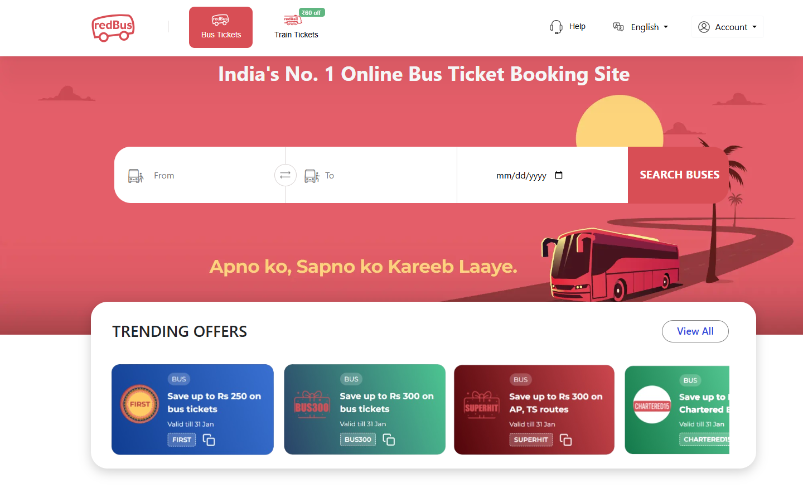
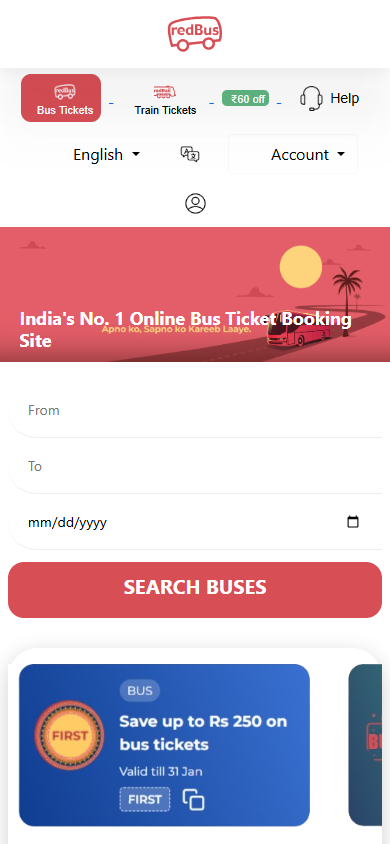
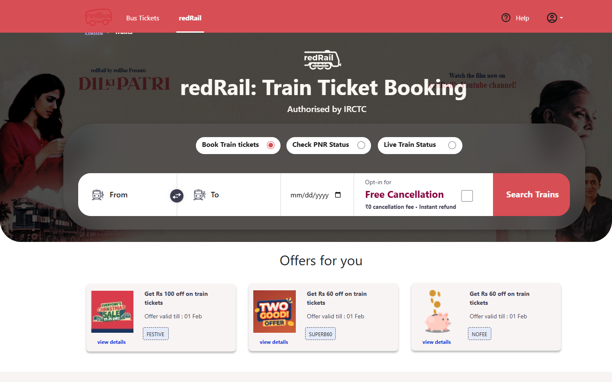
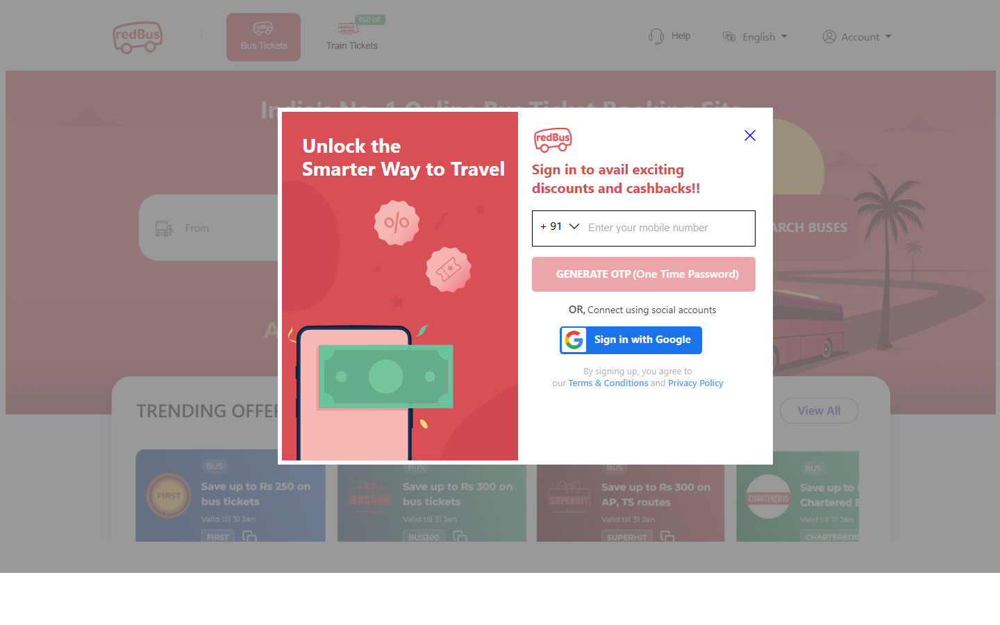

# RedBus Clone

A pixel-accurate, fully responsive front-end clone of redBus.in — India's largest online bus and train ticketing platform. Built with plain HTML5, CSS3 and vanilla JavaScript, with no build tooling required to run it.

<p align="left">
  
  
  
  
  
  
</p>

---

## Live Demo

🔗 **[https://venerable-mandazi-a624aa.netlify.app](https://venerable-mandazi-a624aa.netlify.app)**

Hosted on Netlify. The project is fully static (no backend, no build step), so every page deploys as-is.

---

## Screenshots

<!--
  Add the 4 files below to the /screenshots folder using these exact
  filenames and the images will render automatically — no further
  README edits needed. Capture guide:

  1. home-desktop.png   — home.html, browser width ~1440px, hero banner + search bar visible
  2. home-mobile.png    — home.html, device toolbar at ~390px width, header + stacked search fields
  3. train-desktop.png  — train.html, ~1440px width, train search widget visible
  4. login-desktop.png  — login.html, ~1440px width, full OTP sign-in modal
-->

| Home (Desktop) | Home (Mobile) |
|---|---|
|  |  |

| Train Booking (Desktop) | Login (Desktop) |
|---|---|
|  |  |

---

## Project Summary

This project is a front-end recreation of redBus's booking experience, covering the bus-search homepage, train ticketing flow, and the account-management pages (cancel ticket, change travel date, check PNR status, email/SMS ticket, print ticket) that a real booking platform needs. It started as a pixel-for-pixel desktop clone and was later reworked page-by-page to be fully responsive across mobile, tablet, laptop, and desktop viewports — without changing the original visual design, layout, or functionality.

The interesting engineering problem here wasn't building the UI — it was **making an already-finished, absolutely-positioned, desktop-only layout responsive after the fact**, using only plain CSS media queries. See [Challenges Solved](#challenges-solved) for how that was approached.

---

## Key Features

- **11 fully built pages**: Home, Train Booking, Login/OTP, About Us, Contact Us, Cancel Ticket, Change Travel Date, Check PNR Status, Email/SMS Ticket, Print Ticket, View All Offers
- **Bus & train search UI** with From/To/Date inputs, swap control, and a horizontally-scrolling offers carousel
- **OTP-style login modal** with country-code selector and social sign-in button
- **PNR status checker** with a tabbed (Book / PNR / Live Status) selector
- **Fully responsive layout** — verified on mobile (320px+), tablet, laptop (1280–1440px), and large desktop screens
- **Bootstrap 5 dropdowns and grid** used for navigation menus and the footer column layout
- **Zero build step** — open any `.html` file directly in a browser, no `npm install` required

---

## Responsive Design

Every page renders from a single desktop-first stylesheet and is adapted downward with plain CSS `@media` queries — no CSS Grid, no CSS variables, no framework-level responsive utilities beyond Bootstrap's own grid.

**Breakpoint strategy:**

| Range | Target | Approach |
|---|---|---|
| `≥ 1440px` | Large desktop | Original fixed-position design, untouched |
| `≤ 1439.98px` | Laptop | Fixed-position elements switch to normal document flow |
| `≤ 991.98px` | Tablet | Multi-column rows wrap or stack; font sizes scale down |
| `≤ 767.98px` | Mobile | Full single-column layout; header nav wraps into a compact block |

**Techniques used:** `display: flex` / `flex-wrap: wrap` with `gap` for card and pill layouts, `position: static` to release absolutely-positioned elements back into document flow, `display: none` for purely decorative connector graphics that have no equivalent at narrow widths, and `overflow-x: hidden` as a safety net against sub-pixel rounding overflow.

Verified with real browser rendering (Chromium, automated) across 320px, 375px, 390px, 430px, 768px, 800px, 1024px, 1200px, 1366px, 1440px, and 1920px viewports, checking for horizontal overflow and layout breakage at each.

---

## Technologies Used

| Category | Technology |
|---|---|
| Markup | HTML5 |
| Styling | CSS3 (inline `<style>` per page, media queries) |
| UI Framework | [Bootstrap 5.0.2](https://getbootstrap.com/) (grid, dropdowns) |
| Icons | [Font Awesome 5.15.4](https://fontawesome.com/), Google Material Icons |
| Scripting | Vanilla JavaScript (image carousel controls) |
| Version Control | Git & GitHub |

No package manager, bundler, or backend — the project is intentionally dependency-free beyond CDN-hosted Bootstrap/Font Awesome.

---

## Project Overview

| Page | File | Purpose |
|---|---|---|
| Home | `home.html` | Bus search, trending offers, promotions, FAQs |
| Train Booking | `train.html` | Train search, offers, IRCTC info, app download steps |
| View All Offers | `viewall.html` | Full offers listing |
| Login | `login.html` | OTP-based sign-in modal |
| About Us | `aboutus.html` | Company info, management team |
| Contact Us | `contactus.html` | Office locations, support info |
| Cancel Ticket | `cancelticket.html` | Ticket cancellation form |
| Change Travel Date | `changetraveldate.html` | Date-change request flow |
| Check PNR Status | `checkpnrstatus.html` | PNR lookup |
| Email/SMS Ticket | `emailsms.html` | Resend ticket via email/SMS |
| Print Ticket | `showmyticket.html` | Ticket lookup for printing |

---

## Folder Structure

```
redbus/
├── home.html                 # Homepage — bus search & offers
├── train.html                 # Train booking page
├── viewall.html                # Full offers listing
├── login.html                  # Login / OTP modal
├── aboutus.html                # About Us
├── contactus.html              # Contact Us
├── cancelticket.html           # Cancel Ticket
├── changetraveldate.html       # Change Travel Date
├── checkpnrstatus.html         # Check PNR Status
├── emailsms.html                # Email/SMS Ticket
├── showmyticket.html           # Print Ticket
├── *.svg / *.png / *.jpg / *.webp   # Local image assets (icons, banners, flags, app screenshots)
└── README.md
```

Every page is self-contained: HTML structure, CSS, and any page-specific JavaScript live in the same file. There is no shared stylesheet or script file by design — this mirrors how the project was originally built and was kept intact rather than refactored into shared assets, per project scope.

---

## Installation Guide

No build tools or dependencies to install.

```bash
# 1. Clone the repository
git clone https://github.com/abhisheksinghchinchroli/RedBus-clone.git

# 2. Move into the project folder
cd RedBus-clone

# 3. Open any page directly in your browser
#    (double-click home.html, or use a local server for cleaner relative paths)
```

Optional — serve it locally instead of opening the file directly (recommended for consistent relative-path behavior):

```bash
# Using Python
python -m http.server 5500

# Using Node
npx serve .
```

Then visit `http://localhost:5500/home.html`.

---

## Usage Instructions

1. Open `home.html` as the entry point.
2. Use the **From / To / Date** fields and **Search Buses** button to see the search UI.
3. Navigate to **Train Tickets** from the header to view the train booking flow.
4. Open the **Account** dropdown to reach Cancel Ticket, Change Travel Date, Show My Ticket, Email/SMS, or Login.
5. Resize the browser window (or open dev tools' device toolbar) to see the layout adapt across mobile, tablet, and desktop widths.

---

## Project Workflow

1. **Recreated the redBus UI** page by page in plain HTML/CSS, matching the original desktop layout closely using absolute/fixed positioning.
2. **Audited every page** for responsiveness gaps once the desktop version was complete.
3. **Added a mobile-first-informed layer of media queries** on top of the existing desktop CSS — additive only, so the desktop experience never changed.
4. **Verified visually and programmatically** (automated horizontal-overflow checks across 11 viewport widths) to catch layout breakage that isn't obvious from a single screen size.
5. **Fixed edge cases** — CSS specificity conflicts, invisible text (white-on-white after repositioning), clipped tabs, and a breakpoint gap around common laptop resolutions (1200–1440px) that neither the mobile styles nor the original desktop styles covered correctly.

---

## Challenges Solved

- **Desktop-only absolute positioning.** Nearly every element on every page used `position: fixed` / `position: absolute` with hard-coded pixel offsets calibrated for one specific canvas width. Making this responsive meant selectively releasing elements back into normal document flow at each breakpoint without touching the desktop rules at all.
- **A breakpoint "gap zone."** Early responsive passes stopped at 1199px, but the original desktop layout didn't actually fit until ~1440px — so common laptop resolutions like 1366×768 fell into an unstyled gap and overflowed horizontally. Fixed by extending breakpoint coverage to 1439.98px.
- **Invisible text after repositioning.** Several headings were styled white-on-transparent, intended to sit over a colored background image via absolute overlay. Once flowed into normal layout for mobile, that white text landed on the page's white background and disappeared. Fixed by giving those elements an explicit readable color inside the relevant media query.
- **CSS specificity conflicts.** A compound selector in the original CSS (`.Frequently .hrline`) silently overrode a simpler override rule (`.hrline`) because it was more specific — a reminder that responsive overrides need to match, not just outrank, the specificity they're competing with.
- **Decorative-only elements with no responsive equivalent.** A handful of connector graphics (search-box divider lines, a non-functional swap-arrow icon) had desktop positions computed from raw pixel offsets that made no sense once their container reflowed. Since they carried no text or click handlers, they're hidden at narrow widths instead of floating in the wrong place.

---

## Performance Optimizations

- No JavaScript framework or build pipeline — pages load and render immediately.
- Bootstrap and Font Awesome are loaded from CDN, so they benefit from browser/CDN caching across visits.
- Images use appropriate formats per use case (`.svg` for icons/flags, `.webp` for the hero banner).
- CSS is scoped per page, so no page loads styles it doesn't use.

---

## Future Improvements

- Wire up real form submission and validation (currently front-end only, as expected for a UI clone)
- Extract shared header/footer markup into includes once a lightweight build step is acceptable
- Add a hamburger-menu navigation pattern for very small screens
- Improve accessibility: ARIA labels, keyboard navigation for the dropdowns and carousels, image alt text
- Add dark mode
- Connect to a real backend/API for live bus and train data

---

## Author

**Abhishek Singh**
GitHub: [@abhisheksinghchinchroli](https://github.com/abhisheksinghchinchroli)

---

## License

This project is licensed under the [MIT License](LICENSE) for the code itself.

The redBus name, logo, and brand assets belong to their respective owner (redBus / Ibibo Group / MakeMyTrip) and are used here strictly for educational and portfolio purposes. This is an independent clone built to demonstrate front-end development skills and is not affiliated with, endorsed by, or connected to the official redBus platform.

---

## Acknowledgements

- [redBus.in](https://www.redbus.in/) — original design reference
- [Bootstrap](https://getbootstrap.com/) — grid system and dropdown components
- [Font Awesome](https://fontawesome.com/) — iconography
